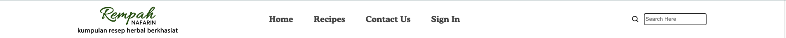
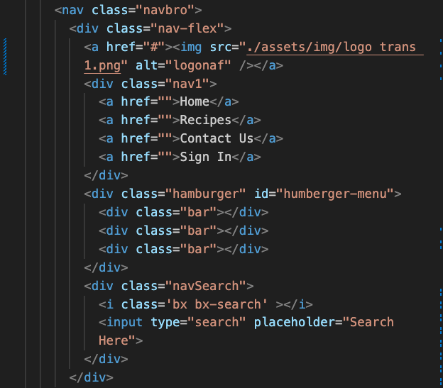
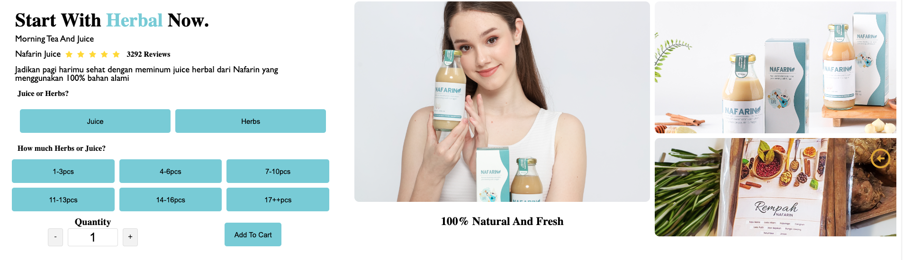
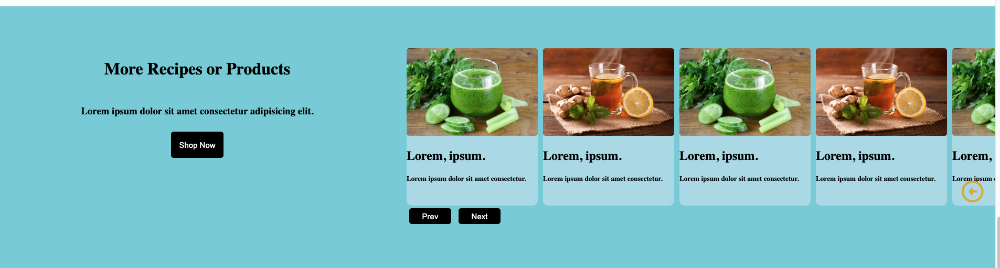
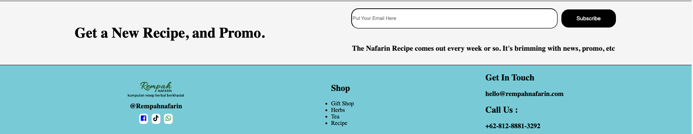

1. building preload for opening website
   
1. building navbar
   
   1.1 i have 3 menu and 4 submenu (logo),(Home,Recipe,Contact US,Sign In), searchbar for desktop only and i using hamburger menu for mobile screen
   
1. building section1
   
   i using video for section 1
1. building section2 with flex and grid area below video,
   
   
1. building main section with flex combining with grid
   
1. building slider image using flex in frontend and a little bit js
   
1. building fields with legend
   
1. using sidebar for contact us
   
1. using flex and column for building footer
   

2.1 i using libraries for logo such as shopee tokopedia and lazada

<link href='https://unpkg.com/boxicons@2.1.4/css/boxicons.min.css' rel='stylesheet'>
3.1 i using jquery for input +- in main section, 
4.1 using js for image slider,hamburger menu and set timeout for preloader

5.1 i use https://www.brewteacompany.co.uk/ for reference in my website because its match with the theme of my website for my business in the future
